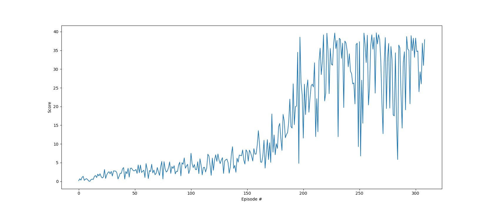

# Project 2: Continuous Control

## Introduction

This project uses the [Reacher](https://github.com/Unity-Technologies/ml-agents/blob/master/docs/Learning-Environment-Examples.md#reacher) environment which moves a double-jointed arm to target locations.

### The Environment
The observation space consists of `33` variables corresponding to position, rotation, velocity, and angular velocities of the arm.  Each action is a vector with four numbers, corresponding to torque applicable to two joints.  Every entry in the action vector must be a number between `-1` and `1` (a continuous space).

A reward of `+0.1` is provided for each step that the agent's hand is in the goal location.
The goal of the agent is to maintain its position at the target location for as many time steps as possible.

### The Problem
The problem I have chosen to solve is option one which contains only one single agent.  It is solved using DDPG, and the problem is considered solved when 100 consecutive episodes have an average score greater than or equal to `+30`.

## Getting Started

1. Download the environment from one of the links below.  You need only select the environment that matches your operating system:

- Linux: [click here](https://s3-us-west-1.amazonaws.com/udacity-drlnd/P2/Reacher/one_agent/Reacher_Linux.zip)
- Mac OSX: [click here](https://s3-us-west-1.amazonaws.com/udacity-drlnd/P2/Reacher/one_agent/Reacher.app.zip)
- Windows (32-bit): [click here](https://s3-us-west-1.amazonaws.com/udacity-drlnd/P2/Reacher/one_agent/Reacher_Windows_x86.zip)
- Windows (64-bit): [click here](https://s3-us-west-1.amazonaws.com/udacity-drlnd/P2/Reacher/one_agent/Reacher_Windows_x86_64.zip)

(_For Windows users_) Check out [this link](https://support.microsoft.com/en-us/help/827218/how-to-determine-whether-a-computer-is-running-a-32-bit-version-or-64) if you need help with determining if your computer is running a 32-bit version or 64-bit version of the Windows operating system.

(_For AWS_) If you'd like to train the agent on AWS (and have not [enabled a virtual screen](https://github.com/Unity-Technologies/ml-agents/blob/master/docs/Training-on-Amazon-Web-Service.md)), then please use [this link](https://s3-us-west-1.amazonaws.com/udacity-drlnd/P2/Reacher/one_agent/Reacher_Linux_NoVis.zip) (version 1) or [this link](https://s3-us-west-1.amazonaws.com/udacity-drlnd/P2/Reacher/Reacher_Linux_NoVis.zip) (version 2) to obtain the "headless" version of the environment.  You will **not** be able to watch the agent without enabling a virtual screen, but you will be able to train the agent.  (_To watch the agent, you should follow the instructions to [enable a virtual screen](https://github.com/Unity-Technologies/ml-agents/blob/master/docs/Training-on-Amazon-Web-Service.md), and then download the environment for the **Linux** operating system above._)

2. Place the file in the DRLND GitHub repository, in the `p2_continuous-control/` folder, and unzip (or decompress) the file.

## Repository Anatomy

### main.py
When all dependencies are installed, the agent running the ddpg algorithm (including both actor and critic) can be trained by executing `python main.py`.
The agent will save two checkpoint files (one for the actor, and one for the critic) if the problem is solved: 100 consecutive episodes with an average score greater than or equal to +30.

### demo.py
Running `python demo.py` will execute a demonstration with the trained agent (including both actor and critic networks).
It should be noted that the environment was solved with an average score of `30.1` over 100 consecutive episodes, so there is NO GUARANTEE that a randomized run will yield a score greater than 30!
Evidence of the solution can be seen in the graphic below.

### ddpg.py
This file contains the code for training the agent after both the actor and critic have been configured.  It also includes the class that generates the Ornstein-Uhlenbeck noise added to the actions (INCLUDING the fix to make OU Noise draw from a random normal distribution... which was a large stumbling block).

### model.py
This file contains the pytoch-based neural network logic to set up the actor and critic.  In particular the number of nodes are specified and the way in which the networks should be randomly initialized.
