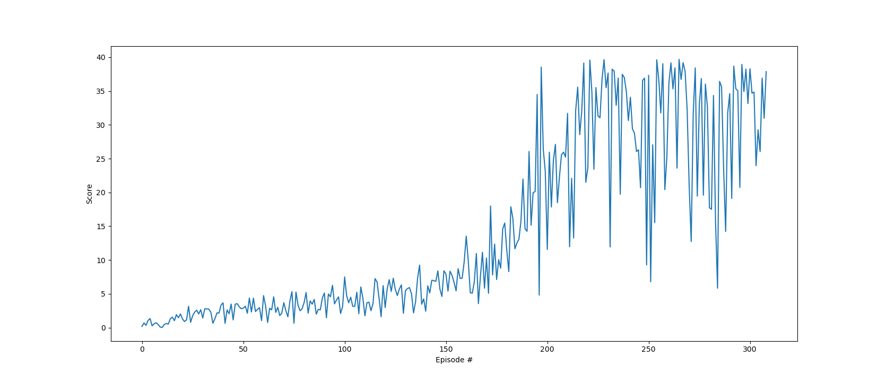

# Overview

This project uses pytorch to implement Deep Deterministic Policy Gradient (DDPG) with replay to solve a double jointed arm problem in a provided Unity environment.
The goal of the environment is to keep the end of the double jointed arm in the target area for as long as possible, with  a reward of `+0.1` provided for each timestep that the end of the arm is in the target area.

The action space is a 4-vector including torques on the joints of each arm and the observation space is a `33` element vector corresponding to the position, rotation, velocity, and angular velocities of the arm.

A straightforward solution was created using Ornstein-Uhlenbeck process noise to the action measurements and a soft network update each timestep.

# Scenario
After the environment has been initially configured, the agent is trained until success is reached or 400 episodes have elapsed (though 400 episodes was not a hard requirement).
Each episode is allowed to last only 1200 timesteps (again, not a hard requirement) or when the environment signals that the episode is done.
The episode is considered to have finished when either 1000 steps have elapsed OR the environment signals that the episode is done.

## Neural Network Design
The neural network used for this solution is crafted using the torch package (pytorch).
In particular, the input state passes through two hidden layers, one with 128 nodes and the second with 256 nodes.
The actor uses this network to predict actions, and the critic uses a network of this shape to predict the value of a state and action pair.

Rectified linear activation (ReLU) is used generally as an activation function for the layers of these networks, though the last layer in the actor network uses hyperbolic tangent since all actions must have values between -1 and 1.
Gradient ascent is used with backward propagation.

The learning-rate for this propagation (loosely, the length of the step of the stochastic gradient ascent) was 1e-3 for the actor and 1e-4 for the critic using the Adam optimizer.

Once enough training timesteps were acquired to satisfy the minibatch size (128 measurements) learning was run on a random sample once each time step.

## Selected Hyperparameters
| Parameter   | Value |
| ----------- | ----------- |
| Buffer Size | 10000       |
| Batch Size  | 128        |
| Discount Factor | 0.99 |
| Soft Update Parameter| 0.999  |
| Actor Learning Rate | 1e-3 |
| Critic Learning Rate | 1e-4 |
| L2 Weight Decay | 0 |
| Network Update Rate | each possible timestep |

# Outcome
**This agent was able to train to the success criterion in 310 episodes.**  The result of that training can be seen below.

# Future Work
While it would be possible to try other algorithms, I would be more interested in improving the convergence speed of this algorithm by following the suggestions set forth in the project description: learning 10 times every 20 timesteps for example, or something different than once per timestep.
Hyper parameters could also be more fully adjusted.
Different noise values could be used, different batch sizes, and different network sizes as well.
While the configuration herein does solve the problem, it doesn't do it particularly rapidly.

It also would likely be easier to solve this problem using option 2 with multiple agents and Asynchronous Actor-Critic.
It seems that there is just some luck involved early in the training process with the single agent case: if it doesn't intersect the target frequently, there's not much information to train on.
Distributing the problem would of course improve solution time and robustness.
This approach would also benefit from using different noise function values to get to a solution more rapidly.
